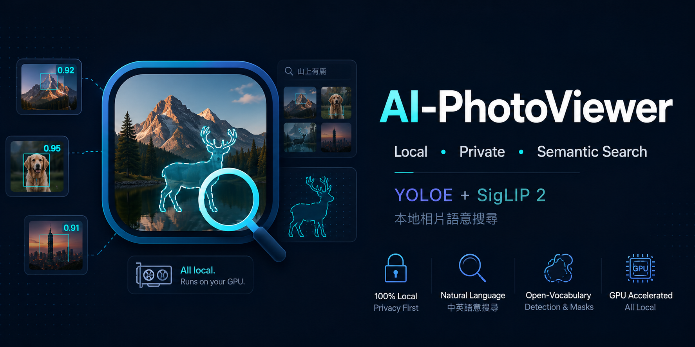

# AI-PhotoViewer

[English](README.en.md) | **繁體中文**

<p align="center">
  
  
  
  
  
</p>

<p align="center">
  
</p>

一個**本地、隱私優先**的相片瀏覽器,結合 **YOLOE 開放詞彙物件偵測** 與 **SigLIP 2 自然語言語意搜尋**(支援中文與英文)。掃描資料夾一次,之後就能用「**語意**」找照片 —— `兩個女生`、`海邊日落`、`cat` —— 並用互動式遮罩檢視每個偵測到的物件。全部在你的 GPU 上本地運行,資料不外傳。

<p align="center">
  
</p>

## ✨ 功能特色

- 🔍 **語意搜尋(中/英)** — 輸入自然語言,回傳排序後的照片(SigLIP 2 向量 + sqlite-vec)
- 🏷️ **開放詞彙偵測** — 每張照片的 YOLOE 類別標籤 + 分割遮罩
- 🖼️ **結果網格** — 縮圖附相似度分數,點選即可檢視
- 🎯 **偵測檢視器** — 在畫布上 hover / 鎖定物件遮罩
- 🎲 **洗牌 + 分頁** — 隨機順序瀏覽、翻頁、每頁張數可調
- 🎚️ **Top-N + 門檻** — 控制回傳數量與相關度
- 🗂️ **Web UI** — 新增 / 重索引 / 取消 / 解除索引資料夾、即時進度、後端狀態,不必碰指令列
- 100% 本地 · 單一 SQLite 檔 · 單張 GPU 即可

## 🔄 流程架構

```
你的照片資料夾
   ──► scan.py    YOLOE-11s-seg-pf:偵測 + 分割        ──► photos.db (SQLite)
   ──► embed.py   SigLIP 2:影像 → 向量                ──► vec_photos (sqlite-vec)
   ──► web_demo   FastAPI:/api/search /api/photos …    ──► 瀏覽器 UI
```

## 💻 系統需求

- NVIDIA GPU(開發於 RTX 5070 Ti,Blackwell)
- Python 3.12(Windows 或 Linux)
- SigLIP 模型約需 1.5–4.5 GB 硬碟空間

## 📦 安裝

```bash
# 1) 建立虛擬環境(建議 uv;一般 `python -m venv` 也可)
uv venv

# 2) 先安裝對應 GPU 的 PyTorch。
#    RTX 50 系列(Blackwell)需要 cu128:
uv pip install torch torchvision --index-url https://download.pytorch.org/whl/cu128

# 3) 安裝其餘依賴
uv pip install -r requirements.txt
```

### 下載 SigLIP 2 模型

把模型資料夾放在某處(例如 `../models/`),再讓 `embed.py` / server 指過去:

| 模型 | 維度 | 大小 | 備註 |
|------|------|------|------|
| `google/siglip2-base-patch16-224` | 768 | ~1.4 GB | 快 |
| `google/siglip2-so400m-patch14-384` | 1152 | ~4.2 GB | 較佳,尤其**中文** |

> 若 HuggingFace 下載卡住(Xet 協定),設 `HF_HUB_DISABLE_XET=1`,或直接用
> `curl -L -C - --retry 40 <resolve-url>` 把檔案抓到本地資料夾。

## 🚀 使用方式

### 快速啟動(腳本)

```powershell
# Windows / PowerShell
.venv\Scripts\python.exe scripts\check-env.py   # 環境檢查(套件 / CUDA / sqlite-vec / 模型)
scripts\run-server.ps1                  # 啟動(預設 127.0.0.1:8000,只本機)
scripts\run-server.ps1 -Port 8080       # 換 port
scripts\run-server.ps1 -BindHost 0.0.0.0    # 開放 LAN
scripts\run-server.ps1 -Stop            # 停止
```
```bash
# Linux / macOS / Git Bash
.venv/bin/python scripts/check-env.py
scripts/run-server.sh                   # 啟動
scripts/run-server.sh --port 8080
scripts/run-server.sh --stop            # 停止
```

首次啟動會**自動建立空的 `photos.db`**,之後直接在歡迎頁索引即可。
模型路徑預設 `../models/siglip2-so400m`,可用 `-Model`(ps1)/ `--model`(sh)或環境變數 `SIGLIP_MODEL` 覆寫。

### 手動 CLI(進階)

```bash
# 1) 掃描照片資料夾(增量、可中斷續跑)
python scan.py "C:\path\to\your\photos"

# 2) 建立語意索引(增量 — 只編碼新照片)
python embed.py --model ..\models\siglip2-so400m

# 3) 啟動 web UI
python web_demo\main.py --db photos.db --model ..\models\siglip2-so400m
# 開啟 http://127.0.0.1:8000
```

切換成不同維度的模型:`python embed.py --model <dir> --rebuild`。
不開 web、直接用 CLI 搜尋:`python embed.py --search "海邊" --model <dir>`。

### 全用 Web UI(不必碰指令列)

啟動 server 後開歡迎頁就能完成索引,**不必先跑 `scan.py` / `embed.py`**:

- 把照片直接丟進專案內的 **`default-image/`**(資料夾裡有 `PUT_YOUR_IMAGES_HERE.txt` 標記位置)→ 回 UI 對它按「**⟳ 全部**」索引;或
- 用 **📁 瀏覽…** 選任意資料夾(或貼路徑)→「**索引新照片**」

索引 / 重索引 / 取消 / 解除索引 / 後端狀態,全部在歡迎頁完成。`default-image/` 會在 server 啟動時自動註冊成預設來源。

## 🖱️ Web UI 操作說明

- **歡迎頁**
  - 後端狀態卡(GPU/VRAM、模型、照片數、覆蓋率)
  - ➕ 新增資料夾(貼路徑或 📁 瀏覽)
  - 已索引清單每列可 **🔁 新增 / ⟳ 全部 / 🗑 移除** 
  -  **📂 開始檢視**進相簿,相簿內「**🏠**」回首頁
- **搜尋框**(中/英)+ `top`(回幾張)+ `門檻`(絕對相似度下限 —— 數字對應縮圖上的綠色徽章;最左 = 全部顯示)
- **結果網格**(左):縮圖 + 相似度;`🎲` 重新洗牌 · `‹ ›` 上/下一組 · 每頁張數 10–40
- **Filter**:依 YOLOE 偵測類別篩選
- **檢視器**(右):hover 物件反白其遮罩、點一下鎖定;下方列出所有偵測
- **❓** 使用說明(中 / EN 切換)· **🗺** 架構流程圖
- 快捷鍵:`←` `→` 換照片 · `R` 隨機 · `Esc` 解除鎖定 / 關閉視窗

> SigLIP 的相似度絕對值很小(~0.04–0.11)且密集 —— 重點是**排序**,不是數字本身。

## 🗂️ 專案結構

```
scan.py            YOLOE 偵測 + 遮罩  → photos.db
embed.py           SigLIP 2 向量      → vec_photos(另有 --search CLI、--rebuild)
inspect_db.py      DB 統計 / 共現分析
add_masks.py       為既有資料補遮罩
web_demo/
  main.py          FastAPI server + REST API(/api/search、/api/photos、/api/thumb、/api/health、/api/index …)
  jobs.py          背景索引工作(scan→embed、進度/取消、prune、sources 管理)
  static/          index.html · app.js · style.css
default-image/     預設來源資料夾(把照片放這裡;啟動時自動註冊)
scripts/           run-server.ps1 · run-server.sh · check-env.py
requirements.txt
```

## ⚡ 效能參考(RTX 5070 Ti · so400m)

| 項目 | 數據 |
|------|------|
| VRAM(搜尋,SigLIP 已載入) | ~6.1 GB |
| VRAM(索引,YOLOE + SigLIP) | ~6.6 GB |
| YOLOE 偵測 + 分割 | ~41 張/秒 |
| SigLIP 嵌入 | ~22 張/秒 |
| 端到端索引 | ~15 張/秒(GPU 推論;含磁碟 / EXIF / DB 略低) |

> 數據為單卡實測;`base` 模型(768 維)更省 VRAM、更快,但中文較弱。

## ⚠️ 注意事項

- **Blackwell(RTX 50xx)** GPU 需要 PyTorch **cu128** 版 —— 預設的 PyPI 版不會吃 GPU。
- 向量索引就存在 **`photos.db` 裡面**(sqlite-vec)—— 單一檔案、好備份。
- `photos.db`、SigLIP 權重(`models/`、`*.pt`)、venv 與產生的縮圖都已被 git 忽略。
- **Server log**:rotating,位於 `web_demo/server.log`,單檔 1 MB、保留 2 份(共 3 MB 上限)。

## 📄 授權

本專案**原始碼以 MIT 授權** —— 見 [LICENSE](LICENSE)。

使用到的第三方元件仍受各自授權約束:

- **YOLOE / Ultralytics** — AGPL-3.0(若散布含此元件的作品,需留意 AGPL 的 copyleft 義務)
- **SigLIP 2** 權重 — 受 Google 模型授權
